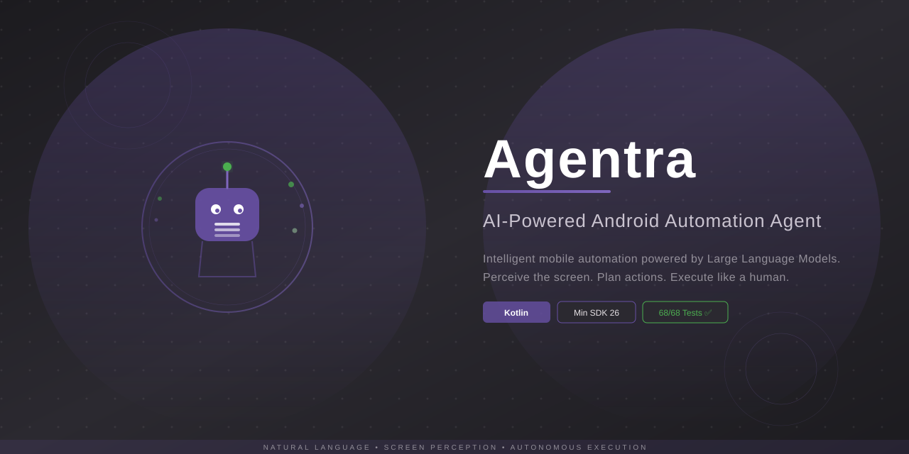

<div align="center">



<br>

[](https://www.android.com/)
[](https://kotlinlang.org/)
[](https://developer.android.com/studio/releases/platforms)
[](https://developer.android.com/studio/releases/platforms)
[](https://developer.android.com/studio/releases/gradle-plugin)
[](https://kotlinlang.org/)

[](https://github.com/samarthshrivas/Agentra/actions/workflows/android.yml)
[](https://github.com/samarthshrivas/Agentra/actions/workflows/android.yml)
[](https://github.com/samarthshrivas/Agentra)
[](LICENSE)
[](https://github.com/samarthshrivas/Agentra/pulls)
[](https://github.com/samarthshrivas/Agentra/releases)

</div>

---

## 📋 Overview

**Agentra** is an intelligent mobile automation agent for Android that uses Large Language Models (LLMs) to perceive the device screen, plan actions, and execute them — just like a human user.

Replace repetitive tasks with natural language commands. Tell Agentra *"Open WhatsApp and send a message"* or *"Book a cab"*, and it handles the rest.

### 🌟 Key Capabilities

- **👁️ Screen Perception** — Captures screenshots and reads UI hierarchy to understand the current screen state
- **🧠 AI-Powered Planning** — Uses LLMs (Qwen 3.5, MiniMax M2.7, GPT-compatible) to decide the next action
- **👆 Action Execution** — Performs taps, swipes, typing, and gestures via Android Accessibility Service
- **🎤 Wake Word** — "Hey Agentra" activates the agent hands-free
- **🖥️ Floating Overlay** — Quick command access from any app
- **🗣️ System Assistant** — Can replace Google Assistant as the default digital assistant

---

## ✨ Features

<table>
<tr>
<td width="50%">

### 🧠 Agent Core
- Perception → LLM → Action → Feedback loop
- Screenshot + UI hierarchy + notification context
- Action history tracking for multi-step reasoning
- Configurable max iterations & failure tolerance
- Real-time log streaming

</td>
<td width="50%">

### 🤖 LLM Integration
- **Qwen 3.5** support
- **MiniMax M2.7** support
- **GPT-compatible API** (OpenAI format)
- Configurable endpoint, key, temperature, tokens
- Base64-encoded screenshot in requests
- Streaming & non-streaming response parsing

</td>
</tr>
<tr>
<td width="50%">

### 🎯 Action System
- **15 action types**: TAP, DOUBLE_TAP, LONG_PRESS, SWIPE, DRAG, TYPE, PRESS, LAUNCH, WAIT, SCROLL, HOVER, SELECT_TEXT, COPY, FINISHED, CALL_USER
- Coordinate normalization (0.0–1.0 LLM-friendly)
- Visual overlay feedback during execution
- Gesture simulation via Accessibility Service
- Intent-based app launching

</td>
<td width="50%">

### 🎤 Wake Word & Assistant
- **"Hey Agentra"** hotword detection
- SpeechRecognizer-based continuous listening
- Foreground service with notification controls
- VoiceInteractionService for default assistant replacement
- Floating draggable button for quick access

</td>
</tr>
<tr>
<td width="50%">

### 🛠️ Tools & Utilities
- **HierarchyDumper** — UI tree extraction (interactive/all nodes)
- **NotificationReader** — Live notification capture
- **ShellExecutor** — Fallback shell-based automation
- **ToolRegistry** — Enable/disable & test 15 individual tools
- **Clipboard** — Text copy from any accessible element

</td>
<td width="50%">

### ⚙️ Configuration
- Model selection & API configuration
- Temperature & max tokens tuning
- Execution speed control
- Wake word toggle & custom phrase
- Floating button toggle
- Dedicated permission management UI

</td>
</tr>
</table>

---

## 🏗️ Architecture

```
┌─────────────────────────────────────────────────────────────────┐
│                        MainActivity                             │
│  (Command Input / Log Display / Status)                         │
└───────────────────┬─────────────────────────────────────────────┘
                    │
┌───────────────────▼─────────────────────────────────────────────┐
│                        AgentCore                                │
│  ┌─────────────┐  ┌──────────────┐  ┌────────────────────────┐ │
│  │ Screenshot  │  │  Hierarchy   │  │   NotificationReader   │ │
│  │  Manager    │  │   Dumper     │  │                        │ │
│  └──────┬──────┘  └──────┬───────┘  └───────────┬────────────┘ │
│         │                │                       │              │
│         ▼                ▼                       ▼              │
│  ┌──────────────────────────────────────────────────────────┐   │
│  │                    LLMInterface                           │   │
│  │        (OkHttp → Qwen / MiniMax / GPT-compatible)        │   │
│  └──────────────────────┬───────────────────────────────────┘   │
│                         │                                       │
│                         ▼                                       │
│  ┌──────────────────────────────────────────────────────────┐   │
│  │                    ActionPlanner                          │   │
│  │       (JSON response → List<Action> with normalization)   │   │
│  └──────────────────────┬───────────────────────────────────┘   │
│                         │                                       │
│                         ▼                                       │
│  ┌──────────────────────────────────────────────────────────┐   │
│  │                    ActionExecutor                         │   │
│  │   (AccessibilityService gestures / Shell fallback)       │   │
│  └──────────────────────────────────────────────────────────┘   │
└─────────────────────────────────────────────────────────────────┘
                            │
                            ▼
┌─────────────────────────────────────────────────────────────────┐
│                    Android System                               │
│  ┌─────────────────┐  ┌──────────────┐  ┌───────────────────┐  │
│  │  Accessibility  │  │  MediaProject│  │   PackageManager  │  │
│  │    Service      │  │  ion/Screensh│  │   (App Launcher)  │  │
│  └─────────────────┘  └──────────────┘  └───────────────────┘  │
└─────────────────────────────────────────────────────────────────┘
```

### Component Flow

```
1. User command → AgentCore
2. Capture screenshot (ScreenshotManager)
3. Dump UI hierarchy (HierarchyDumper)
4. Read notifications (NotificationReader)
5. Send command + screenshot + context to LLM (LLMInterface)
6. Parse LLM response into actions (ActionPlanner)
7. Execute actions on device (ActionExecutor)
8. Repeat until task complete or max iterations
```

---

## 🧱 Tech Stack

| Category | Technology |
|----------|-----------|
| **Language** |  |
| **Build System** |  with AGP 8.7.0 |
| **Min / Target SDK** | API 26 (Android 8.0) → API 35 (Android 15) |
| **UI** | Material 3, ConstraintLayout, RecyclerView |
| **HTTP Client** | OkHttp 4.12.0 |
| **JSON** | Gson 2.10.1 |
| **Async** | Kotlinx Coroutines 1.7.3 |
| **LLM APIs** | OpenAI-compatible (Qwen 3.5, MiniMax M2.7, any GPT-compatible) |
| **Automation** | AccessibilityService API, UI Automator |
| **Wake Word** | Android SpeechRecognizer SDK |
| **Testing** | JUnit 4, MockK, Robolectric, MockWebServer, UI Automator |

---

## 🚀 Getting Started

### Prerequisites

- Android Studio Hedgehog (2023.1.1+) or later
- JDK 17
- Android device/emulator with API 26–35

### Setup

```bash
# Clone the repository
git clone https://github.com/samarthshrivas/Agentra.git
cd Agentra

# Build the project
./gradlew assembleDebug

# Run unit tests
./gradlew test

# Install on device/emulator
./gradlew installDebug
```

### Required Permissions

After installation, grant these permissions:

| Permission | How to Grant |
|-----------|-------------|
| **Accessibility Service** | Settings → Accessibility → Agentra → Enable |
| **Notification Access** | Settings → Special App Access → Notification Access → Agentra |
| **Microphone** | (Prompted on first wake word enable) |
| **Overlay** | (Prompted on first floating button enable) |
| **Default Assistant** | (Optional) Settings → Default apps → Digital assistant → Agentra |

---

## ⚙️ Configuration

All settings are available in the **Settings** screen within the app.

### AI Model Configuration
| Setting | Default | Description |
|---------|---------|-------------|
| Model Name | `Qwen 3.5` | `Qwen 3.5`, `MiniMax M2.7`, or custom |
| API Endpoint | `https://api.example.com/v1/chat` | OpenAI-compatible endpoint |
| API Key | — | Your API key |
| Temperature | `0.7` | Creativity (0.0–1.0) |
| Max Tokens | `2048` | Response length (256–8192) |

### Assistant Settings
| Setting | Default | Description |
|---------|---------|-------------|
| Wake Word | Off | Enable "Hey Agentra" detection |
| Wake Word Phrase | `Hey Agentra` | Custom activation phrase |
| Floating Button | Off | Quick-access overlay button |

---

## 🧪 Testing

### Unit Tests (68 ✅)

```bash
./gradlew test
```

| Test Suite | Tests | What It Covers |
|-----------|-------|---------------|
| `ActionPlannerTest` | 28 | JSON parsing, action types, coordinate normalization, edge cases |
| `LLMInterfaceTest` | 10 | API calls, auth, error handling, request body construction |
| `AppConfigTest` | 12 | Settings persistence, defaults, model config |
| `LogAdapterTest` | 8 | Log entries, clearing, types, recycling |
| `AgentCoreTest` | 6 | Lifecycle, action history, constants |

### Instrumented Tests (35 ⏸️)

```bash
./gradlew connectedAndroidTest
```

| Test Suite | Tests | What It Covers |
|-----------|-------|---------------|
| `MainActivityTest` | 10 | UI elements, toolbar, buttons, input |
| `SettingsActivityTest` | 17 | All sections, sliders, toggles, permissions |
| `DebugActivityTest` | 8 | Buttons, sections, placeholder text |

> **Note:** Instrumented tests are automatically skipped on API 37 (Android 15 preview) emulators due to Espresso `InputManagerEventInjectionStrategy` incompatibility. They pass on standard API 26–35 devices.

---

## 🔄 CI/CD Pipeline

Every push and pull request is automatically built and tested via GitHub Actions.

| Trigger | Job | What Happens |
|---------|-----|-------------|
| `push` / `pull_request` → `master` | **Build & Test** | ✓ Unit tests (68) · ✓ Debug APK · ✓ Test reports |
| `push` → tag `v*` | **Build & Test** + **Release** | Same as above + ✓ Release APK · ✓ GitHub Release |

### Workflow Features

- **Smart caching** — Gradle dependencies cached for faster builds (read-only on PRs)
- **SDK 35** — Installs `android-35` platform + build-tools automatically
- **Parallel jobs** — Build job runs in parallel; release depends on build passing
- **Signing support** — Set `SIGNING_KEYSTORE` / `SIGNING_KEY_ALIAS` / `SIGNING_KEY_PASSWORD` / `SIGNING_STORE_PASSWORD` secrets to sign release APKs
- **Test artifacts** — HTML test reports uploaded even on failure

### Release Workflow

To create a release, push a version tag:

```bash
git tag v0.1.0
git push origin v0.1.0
```

This triggers the pipeline to:
1. Build and test the app
2. Assemble the release APK
3. Sign it (if secrets are configured)
4. Create a GitHub Release with the APK attached

> The workflow file lives at [`.github/workflows/android.yml`](.github/workflows/android.yml).

---

## 📁 Project Structure

```
app/
├── src/
│   ├── main/
│   │   ├── java/com/agentra/app/
│   │   │   ├── agent/
│   │   │   │   └── AgentCore.kt              # Main orchestration loop
│   │   │   ├── action/
│   │   │   │   ├── ActionPlanner.kt          # LLM JSON → actions parser
│   │   │   │   └── ActionExecutor.kt         # Gesture & action execution
│   │   │   ├── llm/
│   │   │   │   └── LLMInterface.kt           # HTTP LLM API communication
│   │   │   ├── screenshot/
│   │   │   │   └── ScreenshotManager.kt      # Accessibility-based screen capture
│   │   │   ├── config/
│   │   │   │   └── AppConfig.kt              # SharedPreferences settings
│   │   │   ├── service/
│   │   │   │   ├── AgentAccessibilityService.kt  # Global accessibility singleton
│   │   │   │   ├── WakeWordService.kt            # "Hey Agentra" detection
│   │   │   │   ├── AssistantService.kt           # Default assistant integration
│   │   │   │   ├── AssistantSession.kt           # Voice session management
│   │   │   │   ├── AssistantRecognitionService.kt # Recognition service stub
│   │   │   │   ├── FloatingPromptService.kt      # Draggable overlay button
│   │   │   │   └── NotificationReader.kt         # Live notification capture
│   │   │   ├── hierarchy/
│   │   │   │   ├── HierarchyDumper.kt        # Accessibility tree walker
│   │   │   │   └── ShellExecutor.kt          # Shell command automation
│   │   │   ├── tools/
│   │   │   │   ├── ToolRegistry.kt           # Tool enable/disable manager
│   │   │   │   └── ToolDefinition.kt         # Tool metadata data class
│   │   │   └── ui/
│   │   │       ├── MainActivity.kt           # Command input & log display
│   │   │       ├── SettingsActivity.kt       # Full configuration screen
│   │   │       ├── DebugActivity.kt          # Raw LLM response viewer
│   │   │       ├── TestToolsActivity.kt      # Tool testing harness
│   │   │       └── adapter/
│   │   │           └── LogAdapter.kt         # Log RecyclerView adapter
│   │   ├── res/
│   │   │   ├── layout/                       # Activity & component layouts
│   │   │   ├── values/                       # Strings, colors, themes
│   │   │   ├── drawable/                     # Icons & UI shapes
│   │   │   └── xml/                          # Service configurations
│   │   └── AndroidManifest.xml
│   ├── test/java/com/agentra/app/            # Unit tests (68)
│   └── androidTest/java/com/agentra/app/     # Instrumented tests (35)
├── build.gradle                              # App module build config
└── proguard-rules.pro                        # ProGuard rules
```

---

## 📊 Development Roadmap

| Phase | Status | Description |
|-------|--------|-------------|
| **Phase 1:** Foundation | ✅ | Project setup, basic UI, permissions |
| **Phase 2:** Core Agent Loop | ✅ | Screenshot pipeline, agent loop, logging |
| **Phase 3:** LLM Integration | ✅ | Multi-model support, prompt design, response parsing |
| **Phase 4:** Action Execution | ✅ | Tap, type, swipe, navigation via Accessibility |
| **Phase 5:** Action Planning | ✅ | JSON schema, validation, coordinate normalization |
| **Phase 6:** Settings Panel | ✅ | Model config, permissions, wake word settings |
| **Phase 7:** MVP Completion | ✅ | Full command→execute pipeline, wake word, assistant integration |
| **Phase 8:** Advanced | 🔜 | Multi-step planning, on-device models, voice commands |

### Upcoming Improvements

- [ ] Production wake word engine (Porcupine/Snowboy for offline use)
- [ ] Voice interaction session UI — full assistant overlay
- [ ] Session persistence & task history
- [ ] Custom wake word training
- [ ] Multi-language support
- [ ] ProGuard rules for release builds
- [ ] On-device model support (ML Kit / TensorFlow Lite)

---

## 🧩 Action Protocol

The LLM communicates actions via a structured JSON format:

```json
[
  {"action": "tap", "x": 0.5, "y": 0.8},
  {"action": "type", "text": "Hello, how are you?"},
  {"action": "press", "key": "enter"},
  {"action": "wait", "duration": 1000}
]
```

### Supported Action Types

| Action | Parameters | Description |
|--------|-----------|-------------|
| `tap` / `click` | `x`, `y` | Tap at coordinates |
| `double_tap` | `x`, `y` | Double tap |
| `long_press` | `x`, `y` | Long press |
| `swipe` | `x1`, `y1`, `x2`, `y2`, `duration` | Swipe gesture |
| `drag` | `x1`, `y1`, `x2`, `y2` | Drag from one point to another |
| `type` / `input` | `text` | Type text |
| `press` | `key` | Press hardware key (back, home, enter, etc.) |
| `launch` / `open` | `packageName` | Launch app |
| `wait` | `duration` | Wait in milliseconds |
| `scroll` | `direction`, `x`, `y` | Scroll in direction |
| `hover` | `x`, `y` | Hover over element |
| `select_text` | — | Select all text in focused field |
| `copy` | — | Copy selected text to clipboard |
| `finished` / `done` | — | Signal task completion |
| `call_user` / `ask_user` | — | Request user intervention |

---

## ⚠️ Known Issues

- **Instrumented tests** are skipped on API 37 (Android 15 preview) emulators due to Espresso `InputManagerEventInjectionStrategy` incompatibility — gracefully skipped via `Assume.assumeTrue(Build.VERSION.SDK_INT < 37)`
- **Wake word** uses cloud-based `SpeechRecognizer` (requires internet); offline engine planned
- **Screenshot** resolution assumes 1080×1920 baseline for coordinate normalization

---

## 🤝 Contributing

Contributions are welcome! Here's how you can help:

1. 🐛 **Report bugs** — Open an [issue](https://github.com/samarthshrivas/Agentra/issues)
2. 💡 **Suggest features** — Start a discussion
3. 🔧 **Submit PRs** — Fork the repo and open a pull request

Please ensure tests pass before submitting:

```bash
./gradlew test
```

---

## 📄 License

This project is licensed under the MIT License — see the [LICENSE](LICENSE) file for details.

---

<div align="center">
Made with ❤️ for the Android automation community
  
[](https://github.com/samarthshrivas/Agentra)
</div>
